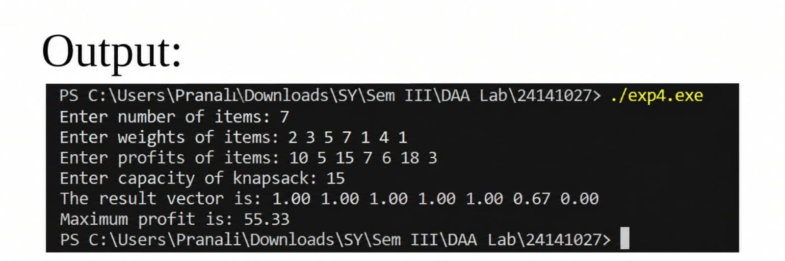

# Experiment No. 04

## Title
**Greedy method to solve problems of Optimal Merge Pattern.**

### Analyse Time and Space Complexity

### Student Details
- **Email:** pranalihanamantbhopale1@gmail.com
- **GitHub:** https://github.com/pranalihanamantbhopale1-sudo/Experiment4.c

---

## Aim

To implement the **Greedy Method to solve problems of Optimal Merge Pattern** and analyze its time and space complexity.

---

## Program

```
#include <stdio.h> 

void optimalMerge(int files[], int n){ 
    int totalCost = 0; 
    for (int i = 0; i < n - 1; i++){ 
        int firstMin = 9999, secondMin = 9999; 
        int firstIndex = -1, secondIndex = -1; 
 
        for (int j = 0; j < n; j++){ 
            if (files[j] != -1 && files[j] < firstMin) { 
                secondMin = firstMin; 
                secondIndex = firstIndex; 
                firstMin = files[j]; 
                firstIndex = j; 
            } 
            else if (files[j] != -1 && files[j] < secondMin) { 
                secondMin = files[j]; 
                secondIndex = j; 
            } 
        } 
 
        int newFile = firstMin + secondMin; 
        totalCost += newFile; 
        files[firstIndex] = newFile; 
        files[secondIndex] = -1; 
    } 

    printf("Minimum total cost of merging files: %d\n", totalCost); 
} 

int main(){ 
    int n; 
    printf("Enter number of files: "); 
    scanf("%d", &n); 

    int files[n]; 

    printf("Enter sizes of files: "); 
    for (int i = 0; i < n; i++) 
        scanf("%d", &files[i]); 

    optimalMerge(files, n); 

    return 0; 
}
```
---
## Output  
---
##Applications:
1.	Used in data compression techniques like Huffman coding.
2.	Applied in file management systems for merging sorted runs.
3.	Useful in external sorting where multiple sorted lists must be combined.
4.	Applied in compiler design and database query optimization.
5.	Used in minimizing total computation time in distributed systems.
6.	Helpful in network optimization and bandwidth allocation problems

---
##Conclusion:
From this experiment, I learned how the Greedy approach minimizes merge costs by merging the smallest files first. Implementing the Optimal Merge Pattern deepened my understanding of heap-based optimization and how local choices can lead to globally optimal results.
